<!DOCTYPE html>
<html class="no-js" lang="en">
  <head>
  </head>
  <body>
    

      
 
        

          <h1>DFM-09 Modification to GPS-Mouse
          </h1>
          
 
          
 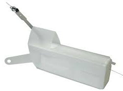 
          

           
          The DFM-09 is a series of small single-board Radiosonde's
          developed by Graw to carry out meteo soundings. 
          Inside houses a GPS Jupiter Telit JN3 or on older versions
          SL869 V2 is also used. 
          If the job is done, they are useless.. 
          But they can be recycled to GPS Mouse. 
           
           
          

            
Contents:

            <ul>
              <li> Overview
                <ul>
                  <li>1.1&nbsp; <a href="#Hardware_Details">Hardware
                        Details</a> </li>
                  <li>1.2&nbsp; <a href="#Needed_stuff_">Needed
                        stuff&nbsp; </a> </li>
                  <li>1.3&nbsp; <a
                        href="#NMEA_19200_Baud_SL_869V2_Modification">SL869
                        Mod</a>. 
                    </li>
                  <li>1.4&nbsp; <a
                        href="#NMEA_9600_Baud_JN3SL869_V2_Modification">
                        JN3/SL869 Short Mod.</a> 
                  </li>
                  <li>1.5&nbsp; <a
                      href="#Windows_NMEA_Mode_SL869_V2_">Windows NMEA
                      SL869</a> 
                  </li>
                  <li>1.6&nbsp; <a
                        href="#Windows_Using_Sirf_Mode_JN3">Windows Sirf
                        JN3</a> 
                    </li>
                  <li>1.7&nbsp; <a href="#Windows_NMEA_Mode_JN3_">Windows
                      NMEA Mode JN3</a> 
                    </a></li>
                  <li>1.8&nbsp; <a href="#Linux_NMEASirf_">Linux
                      NMEA/Sirf mode</a> 
                    </a></li>
                </ul>
              </li>
            </ul>
          

          <h2>Hardware Details 
          </h2>
           
          DFM-09 Details: <a
href="https://www.gruan.org/instruments/radiosondes/sonde-models/graw-dfm-09/"
            target="_blank">https://www.gruan.org/instruments/radiosondes/sonde-models/graw-dfm-09/</a>&nbsp;&nbsp;&nbsp;&nbsp;
          
 &nbsp;  
            Telit JN3 Reference Design
            &nbsp;&nbsp;&nbsp;&nbsp;&nbsp;&nbsp;&nbsp;&nbsp;&nbsp;&nbsp;&nbsp;&nbsp;&nbsp;&nbsp;&nbsp;&nbsp;&nbsp;&nbsp;&nbsp;&nbsp;&nbsp;&nbsp;&nbsp;&nbsp;&nbsp;
             
          

           
           
          Telit Jupiter JN3 Details: <a
href="https://www.telit.com/m2m-iot-products/positioning-timing-modules/positioning-gps-jupiter-n3/"
            target="_blank">https://www.telit.com/m2m-iot-products/positioning-timing-modules/positioning-gps-jupiter-n</a> 
           
          GPS chips are often used on Radiosonde's to get a accurate
          position.  
          The SL869 version operates at NMEA 19200 baudrate if the
          platine stays intact. 
           
          A shorter modified SL869 version without controller will
          operate at NMEA 9600 Baud. 
          As the JN3 shorter version uses SIRF at 9600Baud. 
           
          <h2>Needed stuff 
          </h2>
          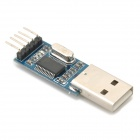 
          DFM-09. 
          USB-TTL converter. 
          Some wires. 
          Soldering tools. 
           
          <h2>NMEA
            19200 Baud SL 869V2 Modification 
          </h2>
           
          Remove the Batteries. 
          White cable on the left should be removed. 
          Sensors and 400MHz transmit antenna on the right from the
          power button. 
          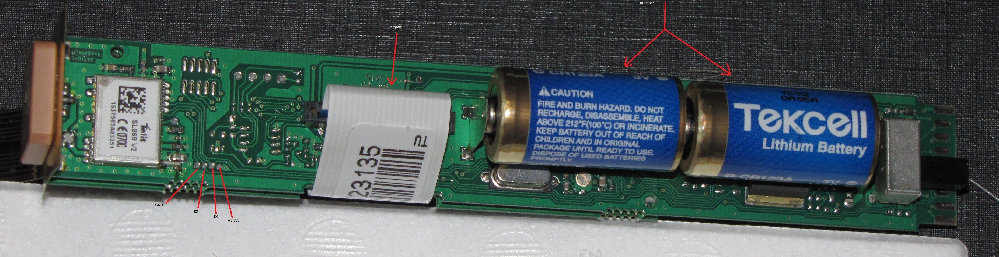
          
And solder TTL-USB converter on 4 tiny pins bottom right
            from JN3 GPS module:

          
1: GND - 
          

          
2: RX

          
3: TX

          
4: +3.3V 
          

          
Build together -&gt;

          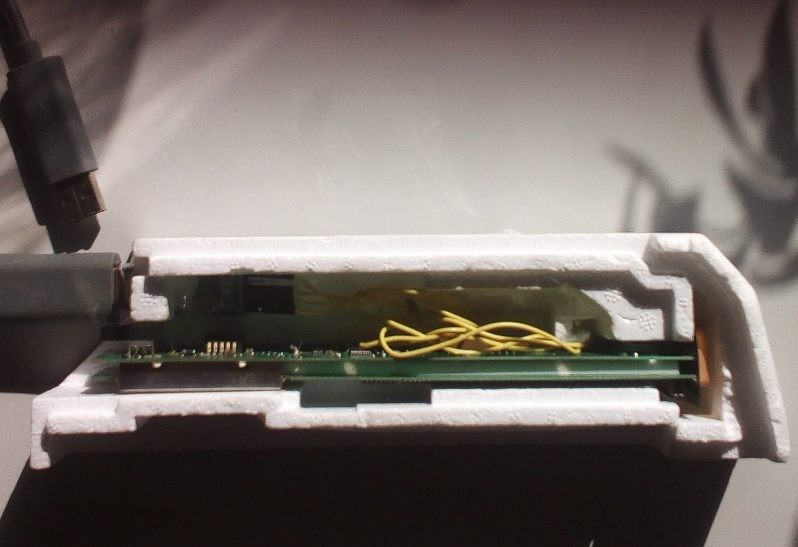
          <h2>NMEA
            9600 Baud JN3/SL869 V2 Modification 
          </h2>
          
  
            For this modification, we did shorten the platine by cutting
            of just before the 4 tiny connection holes. 
          

          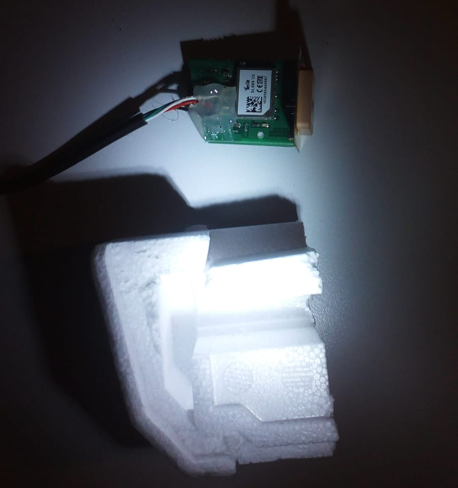
          
And solder TTL-USB converter on 4 tiny pins bottom right
            from JN3 GPS module:

          
1: GND - 
          

          
2: RX

          
3: TX

          
4: +3.3V

          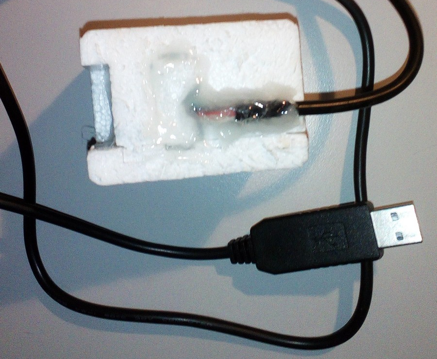 
          
 
            Some Glue to tight up the wires. 
          

          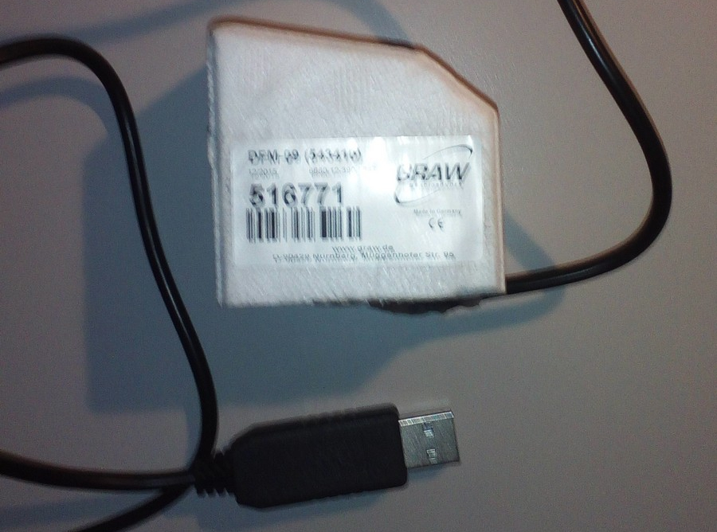 
           
          Ready :) 
          <h2>Windows NMEA
            Mode SL869 V2 
          </h2>
          Place on a site with some good view. 
           
          
          
Connect with USB cable to computer. 
          

          
Select COM Port (most probaly <a
href="http://www.prolific.com.tw/US/ShowProduct.aspx?p_id=225&amp;pcid=41"
              target="_blank">Prolific driver</a> is needed on Windows)
            start GPS application and choose 19200 baud. 
          

          
Some Example programs: 
          

          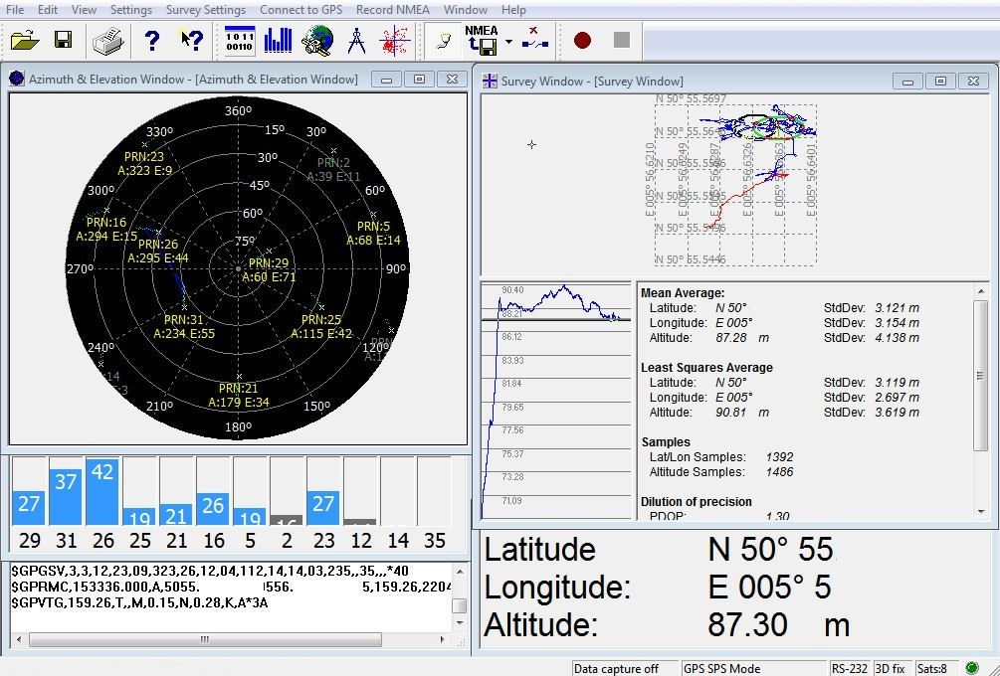
          
DFM-09 works in NMEA 19200 Baud mode.

          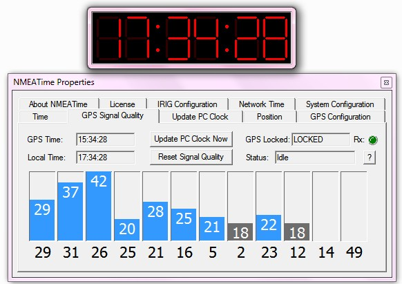 
          
Sync time for Sat's with NMEA Time. 
            It's not possible to use Sirf mode. 
          

          <h2>Windows Using
            Sirf Mode JN3</h2>
          
&nbsp;&nbsp;&nbsp;&nbsp;&nbsp;&nbsp;&nbsp;&nbsp;&nbsp;&nbsp;&nbsp;&nbsp;&nbsp;&nbsp;&nbsp;&nbsp;&nbsp;&nbsp;&nbsp;&nbsp;&nbsp;&nbsp;&nbsp;&nbsp;&nbsp;&nbsp;&nbsp;&nbsp;&nbsp;&nbsp;&nbsp;&nbsp;&nbsp;&nbsp;&nbsp;&nbsp;&nbsp;&nbsp;&nbsp;&nbsp;&nbsp;&nbsp;&nbsp;&nbsp;&nbsp;&nbsp;&nbsp;&nbsp;&nbsp;&nbsp;&nbsp;&nbsp;&nbsp;&nbsp;&nbsp;
             
          

          
Download and start <a
              href="https://www.falcom.de/support/software-tools/sirf/"
              target="_blank">SirfDemo </a>select COM Port (most
            probaly <a
href="http://www.prolific.com.tw/US/ShowProduct.aspx?p_id=225&amp;pcid=41"
              target="_blank">Prolific driver</a> is needed on Windows)
            and use 9600 Baud to connect with the JN3 Short version. 
             
          

          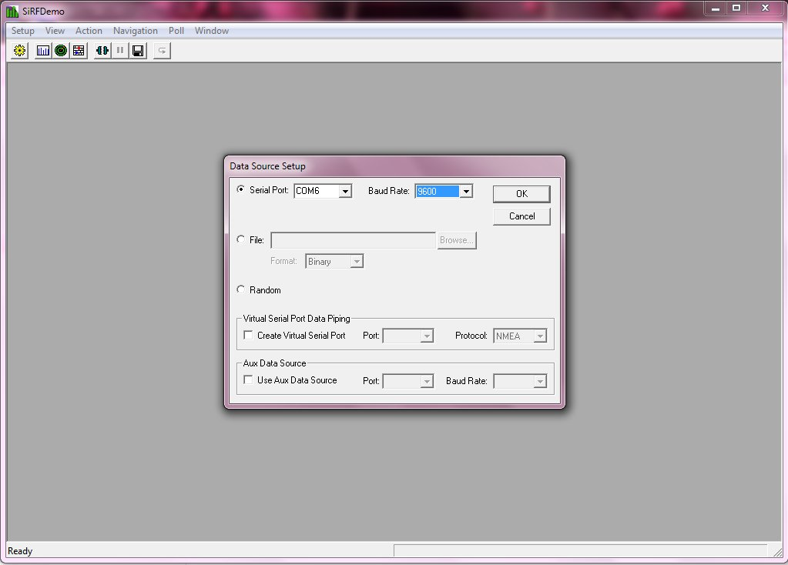
          
JN3 starts itself in Binary Sirf mode.

          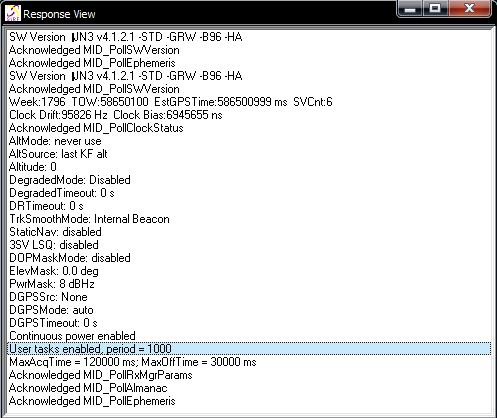
          
From action menu choose Switch to NMEA Protocol.

          
Choose a desired Baudrate.

          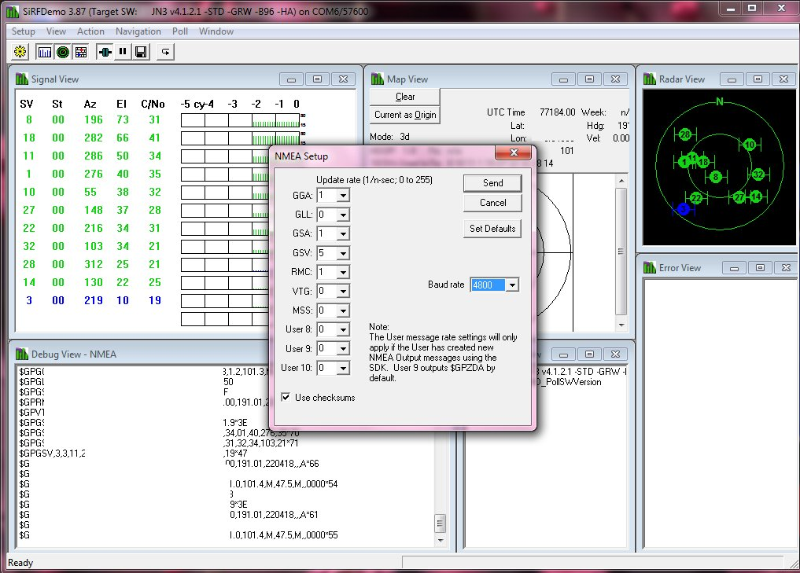
          
DFM-06 works in NMEA 4800 Baud mode.

          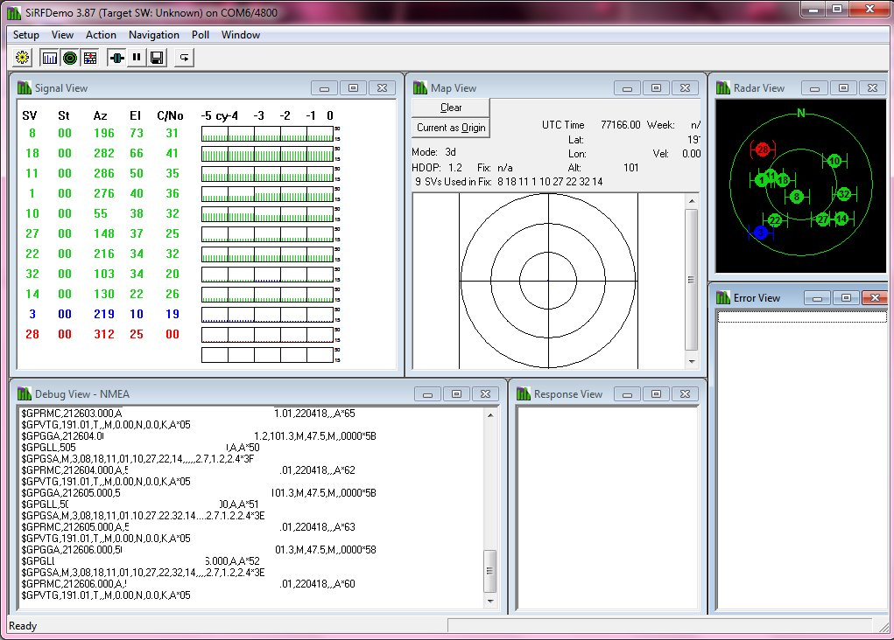
          
Can use any GPS Application know.

          
          
But remember to follow whole procedure again when
            disconnecting the GPS Mouse, it will start again in Binairy
            Sirf Mode..

          
A <a href="/GPS_Com1.bat?raw=true">batch file</a> can be made
            for auto startup GPS mouse in NMEA Mode .

          
Example Com:1 4800 Baud:

          
@echo off

          
echo Switching DFM to GPS mouse.

          
mode com1 baud=9600 parity=n data=8 stop=1

          
copy sirfbinary2nmea.txt com1:

          
echo&nbsp; 4800 baud.

          
 

          <h2>Windows NMEA Mode JN3 
          </h2>
          
  
            Select COM Port (most probaly <a
href="http://www.prolific.com.tw/US/ShowProduct.aspx?p_id=225&amp;pcid=41"
              target="_blank">Prolific driver</a> is needed on Windows)
            start GPS application and choose 9600 baud. 
          

          
Some programs cannot readout the location with this
            modification with exception of SAS-Planet. 
            Not all TPV's are send out. 
            This can be manually done with a terminal program or batch
            files if preferred. 
          

          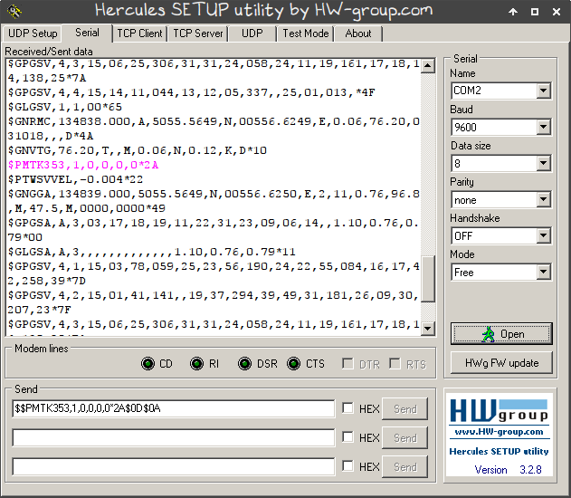 
          
 
            $$PMTK353,1,0,0,0,0*2A$0D$0A 
             
            Baudrate change: $PMTK251,baud*checksum 
            Refresh rate change: $PMTK220,rate[ms]*checksum
            ($PMTK220,200*2F = 5Hz etc...) 
            Turn on Glonass &amp; GPS: $PMTK353,1,1,0,0,0 
          

          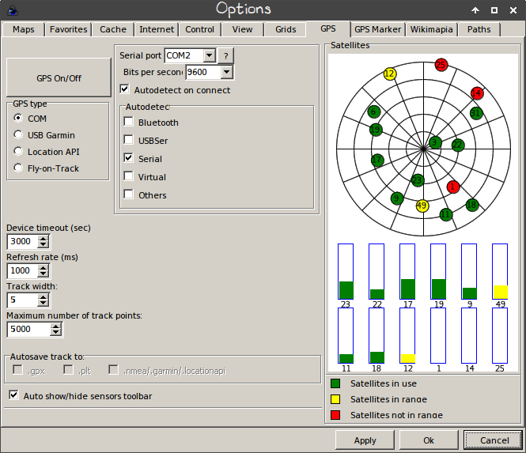
          
Its not possible to use Sirf mode.

          <h2>Linux NMEA/Sirf 
          </h2>
          
In Linux no drivers are needed to install. 
          

          
For Sifrmode on the 9600 JN3 Short Version a script can be
            made: 
          

          
<a href="/sirfbinary2nmea.txt?raw=true">sirfbinary2nmea.txt</a>

          
Make dfm.sh

          
#!/bin/sh

          
dmesg | grep ttyUSB0

          
echo "Switch DFM06 from binary 2 NMEA mode..."

          
cd /home/gps

          
sudo stty -F /dev/ttyUSB0 speed 9600

          
echo "Insert sirfbinary2nmea..."

          
cat sirfbinary2nmea.txt &gt; /dev/ttyUSB0

          
echo "Switch to 4800 Baud..."

          
sudo stty -F /dev/ttyUSB0 speed 4800

          
echo "Done DFM on 4800 Baud" 
             
          

          
 

          
Before make some sudo chown -R &lt;username:username&gt;
            /dev/ttyUSB0

          
You can use GPSD with some build in apps or use
            FoxtrotGPS/Viking. 
             
          

          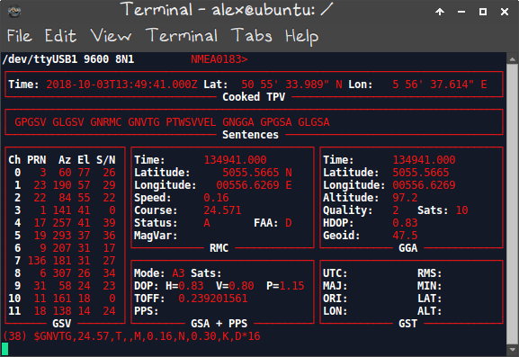
          
gpsd /dev/ttyUSB0

          
 

          
 
            NMEA Mode: 
            dmesg | grep ttyUSB

          
xgps /dev/ttyUSB0

          
cgps -s

          
gpsmon /dev/ttyUSB0

          
 
          

          
<a
href="https://wiki.winehq.org/index.php?title=Wine_User%27s_Guide&amp;oldid=2519#Serial_and_Parallel_Ports" target="_blank">Make
              it work in Wine</a>

          
 

          Note: The shorter JN3 9600Baud version does not need the
          command for position when using GPSD the position shows fine. 
           
        

        

          
Thanks fly out to Andreas6 and PE2BZ.

  </body>
</html>
